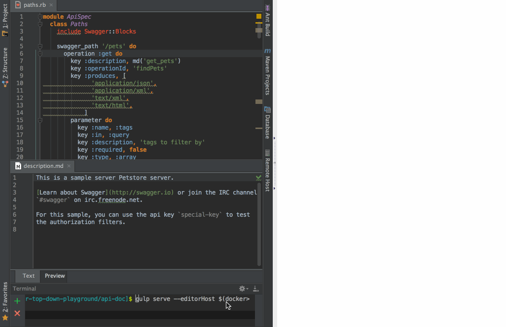

Swagger top-down playground
===========================

Pseudo real-time preview with external editor
---------------------------------------------

```
npm install -g gulp
git clone https://github.com/yewton/swagger-top-down-playground
cd swagger-top-down-playground/api-doc
npm install
gulp --editorHost=$(docker-machine ip default) serve
```

Then `api-doc/spec-files/swagger.yaml` is previewed in a default browser.
The changes on the spec will be previewed (pseudo)real-time(1 sec interval).

Ruby files under `api-doc/blocks` are also API spec using [swagger-blocks](https://github.com/fotinakis/swagger-blocks).
Gulp watches their changes and generates `api-doc/spec-files/swagger.yaml` automatically.

### Demo

